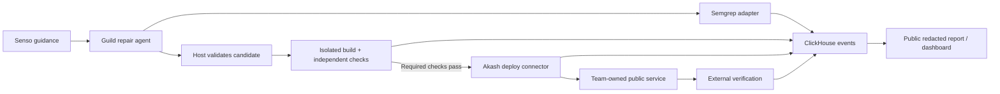

# Antibody

An autonomous repair agent that closes a security hole without closing the business.

Antibody repairs one real SQL-injection defect in a team-owned OWASP Juice Shop deployment, runs an independent behavior-check suite nobody else can edit, deploys the passing candidate to a public endpoint, and publishes observed evidence — all tied to content hashes and image digests, not trusted claims.

**Pitch:** "An autonomous repair agent that closes a security hole without closing the business."

## Status (2026-10-09)

Core pipeline is implemented and unit-tested end to end (114 tests passing): scan → propose → validate → build → check → deploy → probe → evidence.

- **Target pinned**: Juice Shop `v20.2.0`, defect at `routes/search.ts` (SQL injection in product search). Baseline and candidate both built and deployed from source.
- **Guild AI**: real agent session confirmed working (`docs/plan-for-A.md` A1) after resolving a sponsor-side 30–60s accept-latency issue. `GuildPatchAdapter` wired for real sessions.
- **Semgrep**: baseline finding reproduced (`routes/search.ts:23`, `express-sequelize-injection`), rescan confirms candidate clears it. Adapter matches `check_id` by suffix (registry rules get a path-prefixed ID — see `docs/collab.md` Q10).
- **Independent verification worker (B4)**: isolated build + 5-check suite (ordinary search, edge cases, injection regression, access boundary, change-scope), runs in a sandboxed container the agent/candidate can't touch. Verified against a real operator-supplied reference repair (all 5 pass) and two bad candidates (rejected — see below).
- **Senso**: live-verified source-linked remediation guidance (OWASP SQL Injection Cheat Sheet + Sequelize v6 docs), retrieved and cited in candidate context.
- **ClickHouse**: real event insertion and query-backed evidence API/dashboard, deployed and externally verified.
- **Akash**: both the vulnerable baseline and the evidence API/dashboard are live and externally probed from outside the deploying machine. The deploy connector (B5, `src/adapters/akash_deploy.py`) is implemented and unit-tested (push-to-registry, deploy-by-digest, serialized/durable state, reconcile-after-restart, probe-based `observe()`, rollback via `recover()`) but **not yet run against the real Akash API** — wiring into the host runner is the current blocker (`docs/collab.md` Q13).
- **Rejected-candidate proof**: a `WHERE 1=0` mutant (closes the hole by closing the business) and a scope-violating patch (edits the check suite itself) are both rejected through the real validation path, each with origin honestly labeled `operator-supplied-bad-candidate` — never attributed to the model.

Five sponsor tools exercised with real returned evidence: **Guild AI, Semgrep, ClickHouse, Senso, Akash**. ElevenLabs and Pi integrations remain open stretch items.

See [docs/demo-script.md](docs/demo-script.md) for the 3-minute walkthrough and [docs/collab.md](docs/collab.md) for the full decision log.

## Start here

- [PRD and three-person task board](docs/PRD.md)
- [Builder A implementation plan and checklist](docs/plan-for-A.md)
- [Builder B checklist](docs/tasks/B-checklist.md)
- [3-minute demo script](docs/demo-script.md)
- [Decision log / open questions](docs/collab.md)
- [Vendor setup checklist](docs/vendor-setup/README.md)
- [Repository structure](docs/STRUCTURE.md)
- Shared team context in Senso (org `Hackathon-antibody`, folder `shared-context`): project summary and every resolved decision, retrievable by any teammate's agent after `senso login`.

A owns agent/repair; B owns target, independent verification, and deployment; C owns evidence, UI, and additional sponsor integrations.

## How it works



1. Semgrep scans the pinned source and finds the real injection.
2. Senso supplies source-linked remediation guidance.
3. Guild AI's agent proposes a candidate patch.
4. The host validates the diff's scope (only the allowed file), builds it in an isolated container, and runs B's independent check suite — which the agent never sees and can't edit.
5. Only a candidate that passes every required check gets deployed, by exact image digest, through the Akash connector.
6. External HTTP probes verify the live deployment, and every step is recorded as an event in ClickHouse, queryable through the evidence dashboard.

## Tech stack

- **Backend / agent** (`src/agent/`, `src/adapters/`, `src/contracts/`): Python 3.11+ (tested on 3.14), dataclasses for shared contracts. Install with `pip install -e .`.
- **Target under repair** (`tests/fixtures/juice-shop/`, built from upstream source): OWASP Juice Shop, Node.js/TypeScript — treated as an external pinned revision, not part of this repo's own stack.
- **Host API / dashboard** (`src/server/`, `src/web/`): Python host runner + evidence API; `src/web/` is React + TypeScript.
- **Evidence store**: ClickHouse, queried from the host API, never written to directly by the agent.
- **Scanner**: Semgrep CLI, pinned rule set (`config/semgrep/rules.lock.json`).
- **Agent runtime**: Guild AI.
- **Guidance**: Senso (source-linked remediation passages).
- **Deployment**: Akash Network, via a connector that pushes to GHCR and deploys by registry digest.
- Cross-boundary contract: `src/contracts/models.py` dataclasses are the shape source of truth; anything crossing into `src/web` goes over an HTTP API as JSON, not a shared import.

## Shared contracts

Defined in [`src/contracts/models.py`](src/contracts/models.py): `Run`, `Candidate`, `CheckResult`, `DeployRequest`, `DeployResult`, `Observation`, `Event`, `Report`, plus `RunState`/`CheckStatus`/`DeployStatus` enums. The host assigns identity fields (hashes, IDs) — nothing trusts a model- or candidate-claimed value. Every result is bound to the source hash, image digest, test-suite hash, and rule-set identity actually used.

## Running tests

```
pip install -e .
pytest
```

114 unit tests cover the agent loop, validator, adapters (Semgrep, Senso, ClickHouse, Akash deploy, public probe, check worker), answer-matching against upstream's known reference fixes, and adversarial-candidate rejection.

## Project layout

See [docs/STRUCTURE.md](docs/STRUCTURE.md) for the full repo map; `README.md` files under each `src/` subpackage, `tests/`, `scripts/`, and `infra/` document that area's specifics.

## What "preserve" means here

The report says "these checks passed for this revision," not "the application is secure." Juice Shop intentionally contains other vulnerabilities; this project fixes one, verifiably, and discloses exactly that scope.
