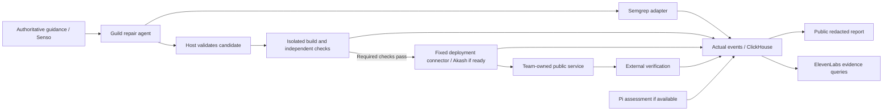

# Security Repair Agent: three-person hackathon PRD

- **Date:** October 9, 2026, Pacific time
- **Author:** Sriram
- **Research assistant:** Codex
- **Team:** Three builders, referred to as A, B, and C until names are assigned.
- **Status:** Finalized planning scope, not an implementation report. No vendor account, target, deployment, model call, or live Zyras analysis was exercised for this PRD.
- **Implementation location:** [hackathon-corner/antibody](https://github.com/hackathon-corner/antibody), using GitHub account `srismart`. Vendor accounts and credentials still need setup; no Workbench credentials are carried into this repository.

## 1. Decision and pitch

Build an agent that repairs one SQL-injection vulnerability in a team-owned deployment of OWASP Juice Shop, verifies the repair without sacrificing ordinary product search, deploys the passing candidate to a public endpoint, and publishes the observed results.

**Pitch:** “An autonomous repair agent that closes a security hole without closing the business.”

The challenge supplied by the organizers is: “Build agents that preserve what matters. Ship an autonomous agent that does real work on the open web.” It requires actual actions grounded in truthful sources and at least three sponsor tools. The agent's consequential action is deploying the verified candidate, followed by HTTP checks against that public deployment. A dashboard or pull request by itself is not our finish line.

What we preserve is concrete: product-search functionality, the declared security boundary, and the integrity of the checks used to authorize publication. We will demonstrate a passing repair and a rejected candidate that removes functionality or attempts to alter verification. A supplied bad candidate is a test input; it must never be attributed to the model unless the model actually produced it.

The agent runs within a pre-authorized envelope: one repository revision, one source path, one vulnerability, one target environment, and fixed operations. It chooses and revises a repair from observed results. The host validates requests and owns execution credentials. We do not manually click through each step and call the resulting sequence autonomous.

The minimum sponsor stack is **Guild AI + Semgrep + ClickHouse**. Seek working integrations with **Senso, Akash, ElevenLabs, and Pi Security**, with the goal of using all seven meaningfully. A planned integration or sponsor logo does not count as an exercised tool. Confirm exact qualification conditions with the organizers.

## 2. Public service and selected repair

Use our own fork of [OWASP Juice Shop](https://github.com/juice-shop/juice-shop), an MIT-licensed security-training application. Its documentation provides source and Docker setup. We will identify the upstream revision in the evidence report and retain applicable attribution. Do not submit this known training vulnerability as a newly discovered defect or submit a repair to upstream without a separate request; vulnerabilities are intentional there.

The selected source path is `routes/search.ts`. The inspected upstream [search handler](https://github.com/juice-shop/juice-shop/blob/master/routes/search.ts) places the `q` input inside a SQL string. The repair should keep the search operation while separating query structure from supplied values. The agent proposes the exact implementation; we do not prefill a successful patch.

B pins a specific source commit and baseline image digest at setup. The branch URL above is a research reference, not an immutable deployment identity. Establish the baseline vulnerability and scanner match on the pinned revision before claiming the repair is supported.

The public service is **our team-owned deployment**, with synthetic records and no customer data, mounted at a URL assigned during setup. OWASP's shared demo is explicitly not an authorized hacking target. Baseline and candidate services are isolated test infrastructure; they have no access to sponsor secrets, host mounts, or Zyras systems. Keep vulnerable target exposure limited to the event and stop it after use.

The first setup risk is building a modified image. Pulling an existing image does not demonstrate that candidate source can be built and released. B must prove a source-to-image-to-HTTP round trip early. Juice Shop contains native dependencies and a frontend build, so use a compatible pinned build environment and cached dependencies. Do not let a full application's build time silently consume the remaining event.

## 3. User journey and autonomous loop

The operator selects the configured service and starts a repair run. The screen shows its real source revision, target, and allowed changes. The agent then:

1. Obtains actual Semgrep output for the configured source and rule set.
2. Retrieves repair guidance through Senso if that integration is available; otherwise uses an explicitly linked authoritative source through an ordinary adapter.
3. Proposes a candidate patch through Guild's agent runtime.
4. Requests validation. The host independently checks changed paths and content identities, builds the candidate, and runs B's immutable verification suite.
5. Reads the actual failures and either revises the candidate or stops. Limit the first version to two candidate attempts with bounded runtime.
6. Requests public deployment only for the exact candidate that passed required checks. The host enforces this requirement even if the agent asks to skip it.
7. Probes the public candidate endpoint, records the results, and publishes a redacted evidence report with links to the deployment and source.

The agent cannot edit tests, scanner rules, release checks, target configuration, or its authorization envelope. Those belong to the host/test infrastructure. Source documents inform a proposed repair; they do not grant execution authority.

A failed or incomplete test blocks deployment. A model refusal, timeout, scanner error, build failure, or unavailable vendor is a real run outcome. The UI shows the affected stage and recovery action, rather than substituting a prepared success.

## 4. Scope and finish line

### Required

- One configured, pinned Juice Shop target and one allowed repair path.
- A real Guild agent run using scanner, patch, validation, and deployment tools.
- A genuine Semgrep baseline finding and candidate rescan, using a pinned rule that is confirmed to match this source.
- An independent before/after behavior suite, including ordinary search and the selected injection effect.
- A host-enforced candidate validation boundary that rejects forbidden changes.
- A passing candidate built from its recorded source and deployed to a real public endpoint.
- Actual external HTTP observations for that deployment.
- ClickHouse insertion and a query-backed evidence view.
- A redacted downloadable report and a public report URL.
- An intentionally overbroad candidate submitted through the same validation path to demonstrate rejection, with its origin disclosed.

### Extensions, in order of available access

1. Senso source-linked guidance in the actual proposal context.
2. Akash hosting for baseline/candidate or the accepted service.
3. ElevenLabs voice queries against real run evidence.
4. Pi assessment incorporated as a separate provider observation.
5. Promotion behind a stable live alias and recovery to a previous deployed revision, if infrastructure already supports it.
6. Live Zyras model analysis, only after a complete standalone run and eligibility/access confirmation.

Three functioning sponsor integrations and public deployment are required. If Akash is slow, use an already accessible authorized host and keep the three core sponsors. If a core sponsor fails, substitute only a working substantive sponsor role; do not claim the original three were used.

Multiple vulnerabilities, arbitrary repositories, automatic dependency installation from user uploads, a universal remediation platform, and a new general-purpose sandbox are outside this build. Target-specific facts stay in adapter/test infrastructure, not in generic agent or report code. There is no customer-facing switch to disable validation.

## 5. Independent verification: what “preserve” means

B authors these checks before A's first candidate. The candidate cannot modify their definitions. Bind every result to the source hash, image digest, test-suite hash, and rule-set identity actually used.

| Check | Expected observation | Failure consequence |
|---|---|---|
| Baseline reproduction | An authorized probe against our pinned target demonstrates the selected injection behavior. Use synthetic canary data and avoid publishing raw leaked rows. | If absent, reassess the chosen revision/probe; no claim of a reproduced vulnerability. |
| Normal product search | Known ordinary queries return expected product IDs and response shape. Compare against approved expectations from the pinned baseline, not merely HTTP 200. | Reject a repair that disables search, returns an empty constant, or changes expected behavior. |
| Search edge cases | Empty input, ordinary punctuation/quotes, and the documented input limit have declared acceptable results. | Reject unexpected errors or functionality loss. |
| Injection regression | The selected payload does not reveal the synthetic canary or produce the unauthorized baseline effect. Response remains consistent with declared behavior. | Reject candidate. This checks selected cases, not all possible injection attacks. |
| Existing access boundary | One identified protected endpoint retains its expected unauthenticated denial and authenticated behavior on the pinned target. | Reject regression. The exact endpoint/status/body expectations must be recorded by B at setup. |
| Change scope | Independent diff changes only the configured repair path; no test, rule, dependency, deployment, or authorization edits. | Reject before build. |
| Candidate rescan | The same pinned Semgrep rule no longer matches the selected defect; scanner errors and other findings remain visible. | Selected finding persists or incomplete scan: block. Other intentional Juice Shop findings do not become a “clean application” claim. |
| Public verification | External probes reach the recorded deployment and repeat ordinary-search and selected injection checks. | Mark release unsuccessful or unresolved; do not claim deployment verified. |

An empty search response or a 500 error is not sufficient evidence that the repair works. Independently verify legitimate results. An unrelated access check only supports its own tested behavior; it does not establish application-wide authorization correctness.

The agent's public report says “these checks passed for this revision,” not “the application is secure.” The original application intentionally contains other vulnerabilities.

## 6. Architecture and shared contracts

Use a small service with a Guild adapter, scanner adapter, restricted patch validator, build/test worker, deployment connector, evidence collector, and public read-only dashboard. Do not port the Workbench or private engine into the new repository.

Agree these interfaces before splitting work. Names are suggested contracts, not claims about a sponsor API:

| Contract | Required fields and behavior |
|---|---|
| `Run` | `runId`, configured target ID, baseline commit/image, allowed paths, rule/test identities, start time, actual state. |
| `Candidate` | `candidateId`, `runId`, base commit, complete patch or file replacement, computed content hash, authoring origin, linked guidance. Host verifies path/content rather than trusting model claims. |
| `CheckResult` | Stable check ID, candidate hash, observed pass/fail/error/unknown, timestamps, redacted artifact reference, adapter/provider origin. |
| `DeployRequest` | `runId`, candidate hash and built image digest. No arbitrary host, shell command, target URL, or mutable “latest” image. |
| `DeployResult` | Actual attempt ID, target, image identity, returned release reference, accepted/failed/unknown, error if present. Admission or a provider response alone is not proof of serving the image. |
| `Observation` | Actual URL/target, probe ID, release reference where observed, status/body digest, time, redacted result. Separate from deployment attempt. |
| `Event` | `eventId`, `runId`, candidate/release references, event type, emitter, observed time, outcome, artifact reference. Deduplicate query output by event ID. |
| `Report` | Versioned schema, input identities, source links, actual checks/observations, origin of candidate, exercised sponsors, limitations, public URLs. No secrets or raw canary values. |

Host state transitions are explicit: `created → scanning → proposing → validating → ready_to_deploy → deploying → verifying → completed`, with failed and unresolved outcomes. Optional second attempts create new candidate IDs and hashes. Events explain transitions; ClickHouse is not the authoritative atomic release store.

For this single-target build, serialize deployment operations through one host coordinator and store state durably in a local transactional store. Claim a deployment once for a validated immutable candidate. A restart or timeout must reconcile with actual deployment state before retrying; do not blindly execute again. The deployment connector exposes narrow operations, not raw agent shell access.

Run candidate code only in dedicated build/test infrastructure with bounded resources and restricted network/credentials. The worker does not inherit deploy, Guild, Senso, ClickHouse, Pi, or Zyras secrets. Only the host connector can initiate public deployment.

## 7. Vendor setup and observable proof of use

Treat account availability, credits, latency, and feature access as unverified until exercised on the new account. Each owner records the setup result and a redacted artifact. Store credentials in ignored/server-side configuration; do not paste keys in chat, source, screenshots, or the public report. Vendor usage must be shown by actual returned evidence.

| Vendor / owner | Specific setup tasks | Completion check | Priority and fallback |
|---|---|---|---|
| **Guild / A** | Select account/workspace; authenticate CLI; create an agent; connect narrowly scoped tools; select available model; confirm outbound access to our adapters. | One actual agent session invokes a harmless tool and receives its real result; preserve session reference. | Core. Resolve runtime tool access in the first setup checkpoint. Ask sponsor for a runnable example if blocked. |
| **Semgrep / A** | Install CLI; pin version and rule set; scan the pinned search handler; verify parse errors/coverage; create a narrowly scoped custom rule if a supplied rule does not detect it. | Actual baseline JSON finding tied to location and rule ID; actual candidate rescan. | Core. Do not invent a scanner hit or claim broad coverage from a custom rule. |
| **ClickHouse / C** | Obtain instance endpoint, database, and credentials; create event table; verify insertion and query; implement redaction and stable event IDs. | Insert a real run event and retrieve it in the dashboard's query; query the final candidate's complete actual checks. | Core. Durable host state remains separate. |
| **Akash / B** | Obtain authorized account, funds/credits and sponsor-supported deploy path; establish image registry access; confirm compatible architecture; start pinned baseline; verify public URL; deploy a rebuilt candidate. | HTTP observation against our actual endpoint and a deployment reference tied to image digest. | Resolve host early. Use an already accessible authorized provider if onboarding is delayed. Akash does not count if unused. |
| **Senso / C, integrated by A** | Obtain key; ingest a small authoritative prevention guide with source URL; retrieve relevant passages; expose retrieval through our adapter. | Actual retrieved source IDs/passages appear in a candidate's context and report. | First addition after core access. Ordinary cited source adapter is fallback, with no Senso usage claim. |
| **ElevenLabs / C** | Obtain agent access; configure a voice agent and authenticated read-only webhook to the evidence API; handle unknown/missing observations. | A spoken question causes a real evidence query and an answer consistent with its rows. | After evidence API works. Voice cannot authenticate a release approval or change deployment authority. |
| **Pi / C** | Ask sponsor for current integration method and permitted repository access; connect the team-owned fork if supported; obtain an actual finding or candidate assessment/export. | Actual Pi-origin result with candidate/source identity and disclosed coverage. | Conditional. Public material inspected did not establish a day-ready API. No simulated finding or wait in the core release path. |
| **GitHub / B** | Confirm new repository/account, permissions, fork attribution, registry/build access, and ability to publish report artifacts. Restrict writes to the team-owned repository. | Actual source commit and accessible artifact/report URL. | Necessary infrastructure; do not count as one of the seven listed sponsors. |

A read-only ElevenLabs interaction is useful operational access, but less central than autonomous repair. Pi and Senso may improve repair context, but their outputs are not independent proof that a patch is correct. Record sponsor use honestly and confirm that each integration qualifies under the event's criteria.

## 8. Three-person task board

### Builder A — agent and repair loop

| ID | Task | Depends on | Done when |
|---|---|---|---|
| A1 | Prove Guild tool execution and Semgrep baseline detection. | New account; B1 source pin. | Actual session/tool result and actual scanner finding exist. |
| A2 | Define candidate/tool contracts jointly with B and C. | Initial team agreement. | Shared typed contract committed; tool responses include IDs and real failure states. |
| A3 | Implement scanner and patch-proposal tools. | A1, A2. | Agent produces a real candidate tied to the baseline revision. |
| A4 | Implement host diff validation and immutable candidate identity. | A2. | Forbidden edits and stale bases are rejected independently of the model. |
| A5 | Connect B's verification response to bounded agent revision. | B4, A3, A4. | Agent can respond to a genuine failure; at most two candidate attempts. |
| A6 | Expose narrow deploy tool guarded by actual required results. | B5. | Only the validated built candidate can be submitted for deployment. |
| A7 | Add Senso retrieval; preserve source/authoring origin. | C4. | Actual retrieved guidance is included without treating it as authority. |

### Builder B — target, independent checks, and deployment

| ID | Task | Depends on | Done when |
|---|---|---|---|
| B1 | Pin source/image, start target, establish synthetic baseline data. | New repo/account. | Known commit/digest and accessible baseline search; no real customer records. |
| B2 | Resolve Akash or fallback host and prove rebuilt-image deployment. | B1; vendor access. | A source-built image is serving at our public endpoint. |
| B3 | Author baseline exploit and functionality checks before candidate generation. | B1. | Baseline reproduction and expected legitimate responses recorded; check definitions immutable to agent. |
| B4 | Build isolated candidate verification worker. | B3; A2. | Results tied to candidate/image/check hashes; errors block release. |
| B5 | Implement fixed deployment connector and external verification. | B2, B4. | Accepted image deploys and external probes report actual observations. |
| B6 | Prepare bad-candidate tests with A and verify legitimate repair. | A4, B4. | Same gate rejects broken-functionality/forbidden-edit candidates and accepts a passing candidate. |
| B7 | Add stable-alias promotion and recovery if time permits. | B5; host supports it. | Observed switch/recovery tied to exact revisions. Restoration is not called a security fix if it restores a vulnerable baseline. |

### Builder C — sponsor access, evidence, and presentation

| ID | Task | Depends on | Done when |
|---|---|---|---|
| C1 | Confirm event reuse/source rules and vendor access with on-site reps. | User-supplied challenge; account selection. | Record actual requirements and identify working setup paths; questions unresolved remain explicit. |
| C2 | Provision ClickHouse and agree event/report contracts. | A2. | Real insert/query works; schema and redaction committed. |
| C3 | Implement evidence API, dashboard, JSON export, and public report. | C2; A/B events. | Shows actual state, failures, sources, candidate differences, and external observations; no fabricated history. |
| C4 | Provision Senso and retrieve authoritative guidance. | Vendor access. | Source-linked passages available to A. |
| C5 | Connect ElevenLabs read-only evidence tools. | C3. | Actual spoken query retrieves and explains a real run. |
| C6 | Obtain and incorporate Pi assessment if available. | Vendor access; B1 or candidate. | Actual provider artifact is shown with scope and origin. |
| C7 | Prepare presentation and submission artifacts; verify exercised sponsors. | Fresh end-to-end run. | Working URLs, redacted report, dependency disclosure, sponsor proof, and short fallback recording of an actual run. |

The new repo's root scripts and shared contracts need a single owner before edits begin. A owns shared candidate/tool contracts, B owns release/check interfaces, C owns event/report contracts. Review interface changes together; do not silently change a contract while another builder implements it.

## 9. Delivery checkpoints and cuts

The originally published event window was 11:00 AM–4:30 PM Pacific. The event has already started. Use time remaining at kickoff rather than assuming a new 5½-hour window. Relative targets below are budgets; compress scope if remaining time is shorter. Freeze features no later than one hour before the actual submission deadline.

| Checkpoint | Team result | Decision if missing |
|---|---|---|
| First 20 minutes | New repo/account resolved; Guild tool, Semgrep match, ClickHouse insert/query; baseline service starts; hosting route identified. | Escalate setup questions to sponsor reps; stop adding optional vendors. |
| First 40 minutes | Shared contracts fixed; independent baseline checks work; a modified source build can reach a public endpoint. | If Juice Shop cannot rebuild promptly, do not promise its release. Agree a smaller attributed target adapter/test service preserving the selected search behavior; disclose changed target and repeat baseline checks. |
| By roughly 90 minutes | Actual candidate runs through immutable checks; host emits linked results. | Cut voice/Pi/Zyras; focus on one passing real patch. |
| By roughly 150 minutes | Passing candidate publicly deployed, external probes run, report query-backed. | Stop additional integrations until this is complete. A local report or PR is incomplete against our selected finish line. |
| After core works | Senso/Akash where available, then ElevenLabs/Pi; rehearse rejecting bad candidates. | Add only one integration at a time with a real proof of use. |
| Final hour | Freeze, fresh run, URLs tested from another device, secrets redacted, submission ready. | Fix failures only; keep a recording of actual execution for presentation-network problems. |

These are planning estimates, not verified onboarding/build durations. Nobody should spend the entire event on an optional provider. Aim for seven sponsors, but never sacrifice the required real action and truthful evidence to claim a larger stack.

## 10. Acceptance and presentation

The submission is complete when a fresh run demonstrates all of the following:

1. The configured service and source identities are real and disclosed; our authorized baseline shows the selected vulnerability.
2. Guild generates a candidate and invokes actual tools without the operator manually executing each stage.
3. Semgrep baseline/candidate observations are tied to a pinned rule and source.
4. A candidate that disables ordinary search or changes protected verification artifacts is rejected. Its supplied or model origin is accurate.
5. A legitimate repair passes independent behavior checks without modifying them.
6. The exact built candidate is deployed to a reachable public endpoint and checked externally.
7. A timeout or unresolved deployment is never presented as success. A failed required check never admits release.
8. ClickHouse returns the actual linked run evidence, and the public report explains the limits of that evidence.
9. At least three qualifying sponsor tools have been exercised. Optional sponsor artifacts are included only when real.
10. Submitted source identifies work written at the event and pre-existing dependencies. Private Zyras code and credentials remain outside the release.

Suggested three-minute story: show ordinary search; show the baseline security failure; start the repair agent; show the independent checks; open the deployed candidate and verify both search and the selected attack case; show one rejected bad candidate; finish with the source-linked report and actual sponsor interactions. Use a recording of an actual run if build latency exceeds presentation time, clearly describing it as a recorded run. Do not manufacture an attack or model response to make the story work.

## 11. Zyras: optional additional functionality

The standalone agent uses ordinary explicit release rules and independent tests. It does not require Zyras, and passing those tests does not produce a formal certificate.

A later or stretch Zyras integration can analyze a reviewed, bounded model of the repair/release workflow: actors, protected targets, allowed actions, and supported invariants. A useful question is whether the represented agent permissions admit a path involving an unauthorized protected action. Do not promise a particular temporal release property until the actual engine contract supports it and a live positive/negative case confirms the mapping.

Claude's [recorded playbook dry run](https://github.com/zyras-dev/zyras-workbench/blob/docs/hackathon-folder/docs/hackathon/2026-10-08-playbook-attack-path-dry-run.md) established a narrower result: moving reimaging to human escalation removed violations from autonomous traces. It did not establish ordering enforcement across human execution. It is not evidence that this release workflow is already supported.

Use Zyras only if organizer rules permit the pre-existing private service and access works on the approved account. Show actual model-bound results and engine version; keep model decisions, host validation, dispatch attempts, and downstream observations separate. Leave engine code private. Model analysis cannot establish arbitrary patch correctness, test completeness, source truth, or actual deployed effects.

The post-event GTM experiment is a useful free repair-verification runner plus a narrow deployment adapter. Test adoption on independently built, authorized services. Broader workflow modeling, version governance, and connector integration become a paid Zyras opportunity only when a real workflow owner needs them. A known training-target success alone establishes neither customer demand nor a moat.

## 12. Decisions needed before implementation

- Repository/account selected: `hackathon-corner/antibody`, GitHub identity `srismart`. Assign the three builder names/ownership; vendor account selection remains pending.
- Working Guild, ClickHouse, and deployment access; vendor credits and spending limits.
- The pinned Juice Shop revision and actual Semgrep rule/check coverage, settled during B1/A1.
- Organizer requirements for reuse, inspectable source, publication, and qualifying sponsor usage.
- Whether Akash can provide a public candidate deployment quickly; otherwise the authorized fallback host.
- Pi's actual sponsor integration, if any; no speculative dependency.
- Permission/readiness for a private Zyras adapter, only if pursuing that extension.

## 13. Primary references and evidence limits

- [Challenge page](https://tokensand.com/cyberhack): challenge wording was supplied directly by Sriram. The page could not be retrieved by the research web tool; do not invent additional rules.
- [OWASP Juice Shop repository](https://github.com/juice-shop/juice-shop), [search source](https://github.com/juice-shop/juice-shop/blob/master/routes/search.ts), [Dockerfile](https://github.com/juice-shop/juice-shop/blob/master/Dockerfile): inspected for target selection, source defect, licensing, and build structure.
- [Guild quickstart](https://docs.guild.ai/quickstart): agent creation, authentication, testing, and publishing. Availability on our account is untested.
- [Semgrep CLI](https://docs.semgrep.dev/cli-reference): actual scanning and output. A matching rule for our pin must still be verified.
- [ClickHouse JS client](https://clickhouse.com/docs/integrations/language-clients/js/index): insertion and query integration. Not an atomic release-control contract.
- [Senso quickstart](https://docs.senso.ai/docs/quickstart): ingestion and source retrieval.
- [Akash documentation](https://akash.network/docs/): deployment route to verify with on-site support.
- [ElevenLabs webhook tools](https://elevenlabs.io/docs/eleven-agents/customization/tools/webhook-tools): authenticated external tool calls.
- [Pi Security](https://www.pi.security/): product positioning; a runnable sponsor integration remains unverified.

Research references were inspected during the October 9 planning discussion. No implementation or new live engine rehearsal was performed. Event progress and actual onboarding results must update the task board rather than be inferred from documentation.
